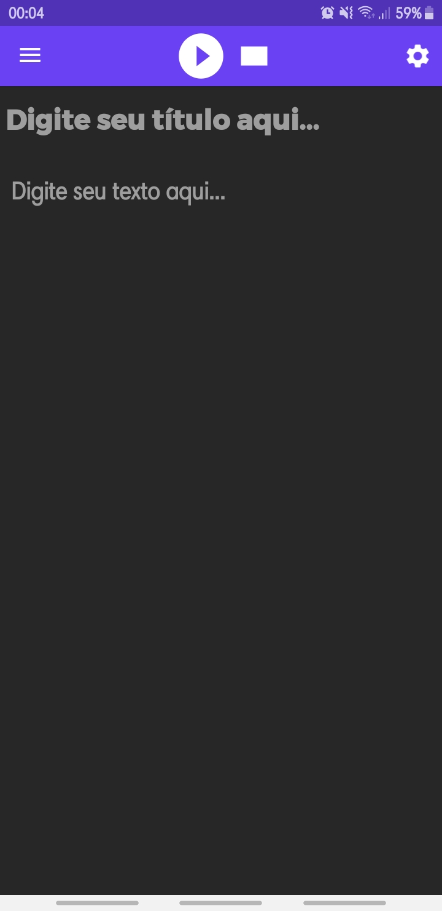
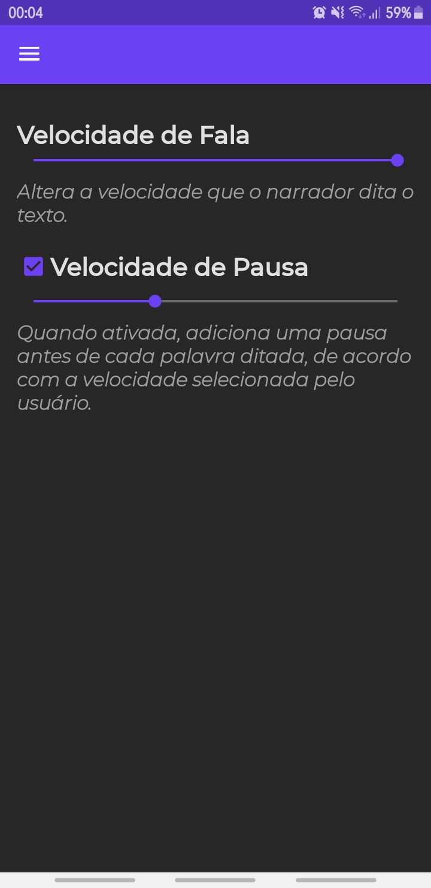
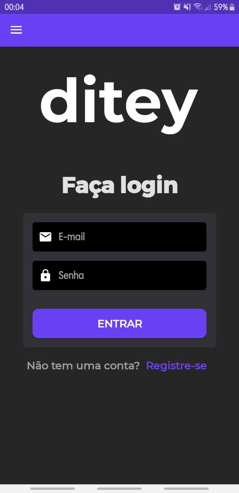
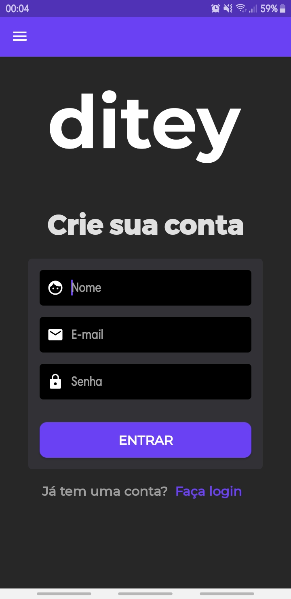
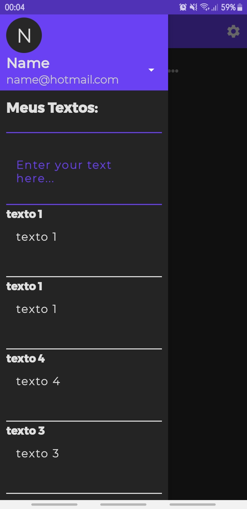

# Ditey(versão mobile)
O Ditey é um leitor de textos customizável que visa facilitar a vida das pessoas ao trabalharem com leitura, transcrição e anotação de textos. 

O Ditey permite que o usuário mantenha seus textos salvos no banco de dados, e mude a velocidade de fala e pausa de acordo com as prefêrencias do usuário.

# Tecnologias
- Java
- Android SDK

# Observações
Algumas funções contidas no [site](https://ditey.vercel.app/) do Ditey não podem ser encontradas na versão mobile.

O aplicativo só funciona em dispositivos com Android 8.0 ou superior.

O aplicativo não funciona no Android 8.1

# Instalação
Baixe o arquivo `ditey.apk` e instale em seu dispositivo móvel ou emulador.

# Instalação(modo de desenvolvimento)
Baixe o projeto e abra a pasta no [Android Studio](https://developer.android.com/studio?gclid=CjwKCAjw8-78BRA0EiwAFUw8LLzQucdP0toq-1LxUPg3W-MayBJbOLnIKIw8BkfcA6KB57osqqfoqhoCcE0QAvD_BwE&gclsrc=aw.ds).

# Como usar
Quando você abrir o aplicativo será redirecionado a esta tela, digite um titulo para o seu texto se quiser salvá-lo mais tarde, depois de inserir algum texto e clicar no ícone play, seu texto será narrado, ao clicar em parar, ele irá terminar a narração do texto.

## Configurações
A opção velocidade de fala diminui ou aumenta a velocidade de voz do narrador.

A opção velocidade de pausa quando verdadeira, adiciona uma pausa a cada palavra que o narrador falar.

A opção modo noturno deixa o aplicativo escuro.

## Entrar
Digite seu email e sua senha para entrar na sua conta.

## Registrar
Digite seu nome(da conta), email e senha para criar uma nova conta.

## Textos Salvos
Após entrar com sucesso, você pode acessar a janela com seus textos salvos, basta clicar para começar a editá-los.

