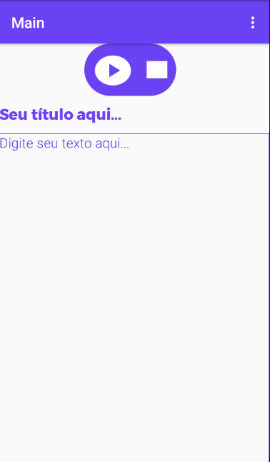
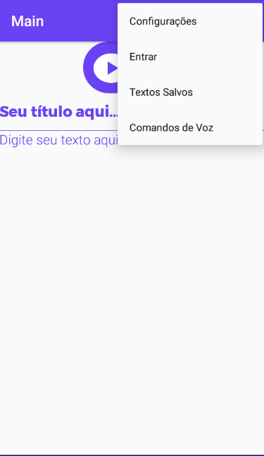
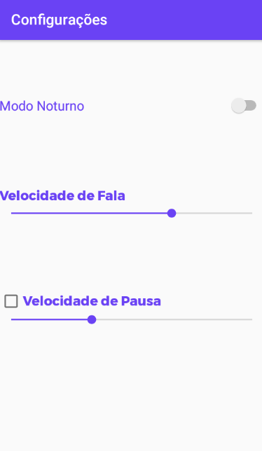
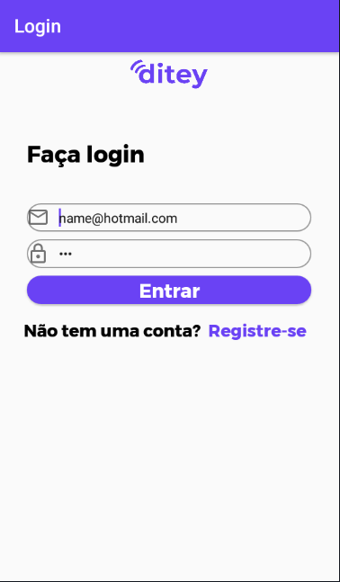
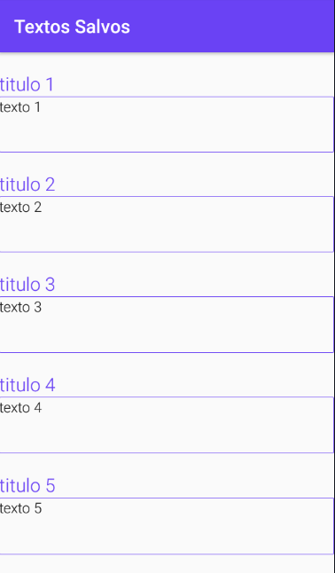

## Ditey(versão mobile)
O Ditey é um leitor de textos customizável que visa facilitar a vida das pessoas ao trabalharem com leitura, transcrição e anotação de textos. 
O Ditey permite que o usuário mantenha seus textos salvos no banco de dados, e mude a velocidade de fala e pausa de acordo com as prefêrencias do usuário.

## Tecnologias
- Java
- Android SDK
- [Volley](https://github.com/google/volley)

## Observações
Algumas funções contidas no [site](https://ditey.vercel.app/) do Ditey não podem ser encontradas na versão mobile.
O aplicativo só funciona em dispositivos com Android 8.0 ou superior.

## Instalação
baixe o arquivo ('ditey.apk') e instale em seu dispositivo móvel ou emulador.

## Como usar
Quando você abrir o aplicativo será redirecionado a esta tela, digite um titulo para o seu texto se quiser salvá-lo mais tarde, depois de inserir algum texto e clicar no ícone play, seu texto será narrado, ao clicar em parar, ele irá terminar a narração do texto.

Ao clicar no menu da barra de ferramentas você encontrará algumas opções.

- **Configurações:** altere a velocidade de voz e de fala de acordo com suas preferências.
- **Entrar:** caso queira salvar seus textos, é preciso criar uma conta e fazer login.
- **Textos salvos:** tela onde você pode acessar os textos que você salvou.
- **Comandos de Voz:** função disponível apenas no [site](https://ditey.vercel.app/)

# Configurações
A opção velocidade de fala diminui ou aumenta a velocidade de voz do narrador.
A opção velocidade de pausa quando verdadeira, adiciona uma pausa a cada palavra que o narrador falar.
A opção modo noturno deixa o aplicativo escuro.

# Entrar
Digite seu email e sua senha para entrar na sua conta, ao entrar no aplicativo você encontrará essa conta de testes.

# Registrar
Digite seu nome(da conta), email e senha para criar uma nova conta.

# Textos Salvos
Após entrar com sucesso, você pode acessar a tela de textos salvos:
- Para salvar um texto clique e segure a caixa de texto.
- Para trocar o texto da tela principal com o texto salvo clique uma vez.

# Comandos de voz
Essa opção ainda não está disponível para o aplicativo mobile e se encontra funcionando apenas no [site](https://ditey.vercel.app/)
